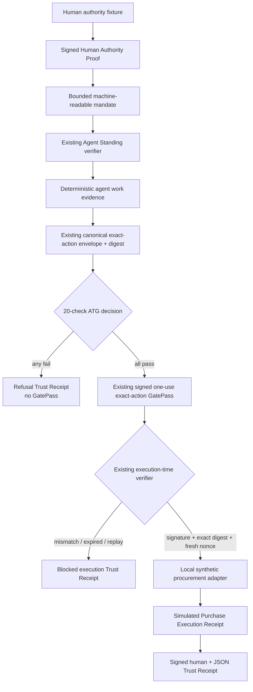

# P3-M154 — Exact Action Trust Gateway working prototype report

## Verdict

**PILOT-READY PROTOTYPE LOCK — PASS**

Agent Trust Gate™ now includes a working local pilot-ready prototype for exact-action procurement control. It performs the full software control flow from synthetic authorised human, bounded mandate and verified agent standing through deterministic research, negotiation, canonical purchase proposal, pre-action verification, signed one-use GatePass, simulated procurement execution and complete human/machine audit receipt.

This verdict applies only to the local synthetic V1 boundary. It is not a production-readiness, security, regulatory, legal-compliance or real-payment claim.

## Mission result

- Product: **Agent Trust Gate™ — Exact Action Trust Gateway**
- Status: **WORKING LOCAL PILOT PROTOTYPE**
- Organisation: Northstar Retail Ltd — synthetic / fictional
- Authorised employee: Alex Morgan, Procurement Director — synthetic
- Agent: Northstar Procurement Agent 04 — synthetic
- Allowed exact purchase: Harbour Supply Ltd, 200 units Product X, £23,750 GBP
- Authority and mandate maximum: £25,000 GBP
- Launch: `npm run prototype:exact-action`
- Deterministic suite: `npm run prototype:exact-action:smoke`

## Repository audit

The repository was inventoried before implementation. The following were identified as the strongest applicable components.

### Reused directly

- `src/human-authority-demo.mjs` — existing Ed25519 Human Authority Proof, active identity/authentication/authority/freshness/replay rules. Extended with Northstar fixtures and an authority-only output so this stage cannot issue a competing purchase GatePass.
- `src/agent-standing.ts` — existing signed standing proof, key-control challenge, principal evidence, organisation/accountable-human sponsorship, delegation, scope, limits, expiry, revocation and exact-request binding. Extended with one exported Northstar fixture builder; enforcement remains in `evaluateAgentStanding`.
- `src/exact-action-gatepass.ts` — canonical JSON, canonical action envelope, SHA-256 action digest, signed exact-action GatePass, verification profile, verifier-owned clock, expiry, one-use nonce store, execution-time binding verification and execution receipt.
- `src/local-signed-proof.ts` — canonical fixture payload hashing and deterministic Ed25519 signing/verification for the unified Trust Receipt.
- `src/gateway-auth.ts` — optional local API-key authentication.
- `src/gateway-rate-limits.ts` — process-local request limiting.
- `src/gateway-logging.ts` — local JSONL gateway request audit logging.
- `src/gateway-server.ts` — Node HTTP server architecture and fail-closed local route conventions.

### Audited and retained without forced coupling

- `src/gatepass-core.ts` — mandate/evidence/intent/approval policy semantics.
- `src/gatepass-tool-wrapper.ts` — pre-tool-call enforcement pattern.
- `src/end-to-end-gatepass-pilot.ts` — end-to-end GatePass/refusal/settlement evidence lifecycle.
- `src/embedded-commerce-gatepass.ts` — basket, merchant, substitution and checkout refusal semantics.
- `src/local-end-to-end-money-gate-proof.ts` — local no-real-settlement proof boundary.
- `src/local-settlement-blocker.ts` — receipt-based settlement blocking.
- `src/local-gate-pass-receipt.ts` — structured allow/review/refusal receipt design.
- `src/local-gate-pass-protection.ts` — the earlier receipt family's validity and in-memory replay model.
- `src/local-trust-receipt-verifier.ts` — structured receipt verification and settlement eligibility.
- `src/local-signed-proof.ts` — signed local receipt/proof envelopes.
- `src/gatepass-reviewer-kit.ts` and reviewer documentation — reviewer sequencing, evidence clarity and claims boundaries.

These older receipt and settlement components remain intact. P3-M154 does not mix their GatePass format with the canonical exact-action purchase GatePass. This avoids two authorities, two action digests or two one-use state machines governing the same simulated purchase.

## Components added

- `src/exact-action-trust-gateway-prototype.ts`
  - Northstar scenario orchestration;
  - machine-readable bounded mandate;
  - deterministic supplier research and negotiation evidence;
  - exact purchase action construction;
  - 20 fail-closed ATG checks;
  - unified evaluate/execute/verify integration object;
  - synthetic procurement adapter;
  - machine JSON and human-readable Trust Receipts;
  - seven-scenario smoke suite.
- `src/exact-action-trust-gateway-prototype-server.ts`
  - loopback-only static/API server;
  - evaluate, execute, replay and receipt-verification routes;
  - existing auth, local rate-limit and audit-log integration;
  - bounded JSON and browser hardening headers.
- `src/exact-action-trust-gateway-prototype-cli.ts`
  - one-command browser launch;
  - deterministic terminating smoke mode.
- `prototype/exact-action/index.html`, `app.js`, `styles.css`
  - framework-free buyer experience with six visible stages, seven scenario selectors, 20 checks, decisions, execution controls and dual receipt views.
- `test/exact-action-trust-gateway-prototype.test.ts`
- `test/exact-action-trust-gateway-prototype-server.test.ts`
- P3-M154 architecture, buyer walkthrough, integration and report documentation.

## Architecture

## Data flow

1. The existing human-authority demonstrator evaluates a synthetic Northstar employee and authentication fixture against the proposed purchase fields.
2. An allowed authority-only result produces a signed Human Authority Proof with human, organisation, role, department, authentication, exact action, £25,000 limit, supplier/category, jurisdiction, risk, issue/expiry and nonce evidence.
3. The product layer creates a machine-readable mandate linking that proof, Alex, Northstar, the agent, the human instruction, permitted actions, supplier/category, 200-unit quantity, GBP, £25,000, GB jurisdiction, medium risk, validity and evidence requirements.
4. The existing Agent Standing evaluator verifies the agent's key-control, organisation principal, accountable-human sponsor, signed delegation, scope, amount, supplier, resource quantity, expiry, revocation and exact standing-request digest.
5. A deterministic activity record compares three synthetic offers and records Harbour's £24,000 to £23,750 negotiation plus improved Net 45 terms.
6. The existing exact-action engine canonicalises all action fields and produces the sole purchase `actionDigest`.
7. Twenty checks run. A single block causes refusal and no GatePass.
8. On allow, the existing engine signs a one-use GatePass and registers its nonce as unused.
9. The synthetic procurement adapter is reachable only through `verifyAndExecuteSimulatedAction`. The verifier reconstructs the proposed envelope, verifies the signature/key/profile, compares bindings, checks time and consumes the nonce.
10. The adapter returns only a local synthetic acknowledgement. The existing execution receipt is embedded into a signed buyer-facing Trust Receipt.

## Authority model

Alex Morgan's fixture establishes:

- synthetic natural-person employee ID and verified authentication evidence;
- Northstar Retail Ltd appointment and active employment status;
- Procurement Director role and Procurement department;
- supplier-purchase action authority;
- GBP authority up to £25,000;
- Harbour Supply Ltd / Product X bounds;
- GB jurisdiction and medium risk-tier permission;
- proof issue/expiry and unused nonce;
- Ed25519 local-fixture integrity over the exact Human Authority Proof.

The wrong-human scenario uses an active, authenticated Procurement Analyst fixture with supplier-research permission but no purchase authority. It therefore proves that identity alone is insufficient.

## GatePass flow

- GatePass issuance uses `issueExactActionGatePass` from the existing canonical engine.
- The signed payload contains the complete canonical action envelope.
- The action envelope binds the Human Authority Proof reference/digest, mandate reference/digest, agent/session/run, policy, evidence, tool/schema/operation, supplier target, amount/currency, environment, validity, nonce and idempotency key.
- The canonical arguments additionally expose every buyer-required purchase field.
- Execution uses a verifier-controlled clock and the same process-local `InMemoryNonceStore` that received issuance registration.
- Signature, key, exact digest, context, time and unused nonce must all pass before the adapter callback is invoked.
- A successful verification consumes the GatePass. A second presentation returns `GATEPASS_ALREADY_CONSUMED` and `BLOCKED_REPLAY`.

## Simulated execution boundary

The adapter has no external client and makes no network calls. Its only allowed output is a deterministic `synthetic-procurement://purchase/...` acknowledgement. Every execution and Trust Receipt carries false flags for external API call, real order, real payment and real settlement.

Rules verified:

- no GatePass → `BLOCKED_NO_GATEPASS`;
- malformed GatePass → `BLOCKED_INVALID_GATEPASS`;
- different amount or supplier → `BLOCKED_ACTION_MISMATCH`;
- expired GatePass → `BLOCKED_EXPIRED_GATEPASS`;
- already-consumed GatePass → `BLOCKED_REPLAY`;
- exact fresh one-use GatePass → `SIMULATED_PURCHASE_COMPLETED`.

## Scenario results

| Scenario | Pre-action result | GatePass | Execution result | Expected matched |
|---|---|---|---|---|
| A — Allowed £23,750 | `GATEPASS_ISSUED` | Yes | `SIMULATED_PURCHASE_COMPLETED` | Yes |
| B — Overspend £31,000 | `ACTION_REFUSED` | No | `BLOCKED_NO_GATEPASS` | Yes |
| C — Wrong Human Authority | `ACTION_REFUSED` | No | `BLOCKED_NO_GATEPASS` | Yes |
| D — Expired Authority | `ACTION_REFUSED` | No | `BLOCKED_NO_GATEPASS` | Yes |
| E — Action Tampering £24,250 | Original allowed | Yes | `BLOCKED_ACTION_MISMATCH` | Yes |
| F — Replay | Original and first use allowed | Yes, then consumed | `BLOCKED_REPLAY` on second use | Yes |
| G — Agent Standing Failure | `ACTION_REFUSED` | No | `BLOCKED_NO_GATEPASS` | Yes |

The non-buyer expired-mandate control is also refused.

## Buyer walkthrough result

**PASS — functional local route traversal.**

The running server was traversed in the requested order:

- default Alex/mandate/evidence/£23,750 preview loaded;
- 20 of 20 ATG checks passed;
- generated GatePass `gatepass_exact_8d6930c307b26dc92307b3c4` was issued;
- the simulated purchase completed;
- the Trust Receipt opened and verified;
- the same GatePass was re-run and returned `BLOCKED_REPLAY` with “GatePass already consumed / replay refused”;
- the £31,000 scenario was selected and refused;
- no GatePass was issued and execution returned `BLOCKED_NO_GATEPASS`;
- the refusal receipt opened, verified and displayed both requested and authorised amounts.

The execution environment had no connected in-app/external browser, so screenshot-based visual inspection could not be performed. Static UI/server tests verified page delivery, required text, Content Security Policy and the complete HTTP interaction. This is recorded as a QA limitation, not represented as completed visual screenshot review.

## Test evidence

Final commands and results:

| Command | Result |
|---|---|
| `npm run typecheck` | PASS |
| `npm run build` | PASS |
| `npm test` — main invocation | 675 passed, 0 failed |
| `npm test` — posttest invocation | 669 passed, 0 failed |
| `npm run test:human-authority` | 9 passed, 0 failed |
| `npm run test:agent-standing` | 13 passed, 0 failed |
| `npm run test:exact-action-prototype` | 32 passed, 0 failed |
| `npm run prototype:exact-action:smoke` | 7/7 scenarios passed |

`npm test` therefore completed **1,344 test cases with zero failures** across its two configured Node test invocations. Focused command counts overlap with this repository total and are reported separately rather than added again.

Focused tests cover authorised/unauthorised/expired authority; active/revoked standing; valid/expired mandate; under/over spend; allowed/changed supplier; canonical digest; signing and verification; GatePass expiry, replay and consumption; missing/malformed GatePass; execution and refusal receipts; human/machine receipt agreement; optional API-key auth; local rate limiting; loopback binding; malformed HTTP input; and no external network call in every scenario.

## Security and failure boundaries

- Unknown or malformed inputs fail closed.
- No policy “best effort allow” exists; all 20 checks must pass.
- Human identity without action authority fails.
- Agent identity without active signed delegation fails.
- Missing/expired mandate or evidence fails.
- Action changes after issuance fail the existing canonical digest and contextual bindings.
- Nonce consumption occurs at the verification boundary before the adapter acknowledgement.
- Process-local replay state is explicit and not misrepresented as distributed protection.
- Browser server start rejects non-loopback host values.
- Default API mutation limit is process-local and bounded; optional API-key mode reuses existing controls.
- Static assets use a self-only CSP; JSON bodies are size bounded.
- Fixture signing material is public/deterministic and explicitly not production key custody.

## Limitations

- Synthetic fixtures only; no real person, company registry, identity provider, HR system, WebAuthn credential or runtime attestation.
- Deterministic public local keys; no HSM, KMS, production rotation/revocation service or secret custody.
- Process-local sessions, nonce state and rate limits; restart clears them.
- No tenant boundary, distributed idempotency or atomic durable replay store.
- No live LLM, internet research, supplier API, procurement API, payment rail, bank API, order, contract or settlement.
- No production monitoring, alerting, reconciliation or incident response integration.
- No regulatory, security, compliance or legal certification.
- Browser screenshot visual QA was unavailable in this execution environment; functional route and static UI checks passed.

## Future real-integration points

1. Replace fixture human authority with customer-governed identity, employment/appointment, authentication and authority sources.
2. Register customer agents, principals, real keys, delegations and revocation evidence.
3. Externalise policy and mandate governance without changing the canonical exact-action/GatePass contract.
4. Replace in-memory nonce state with a durable atomic single-use store.
5. Deploy behind customer authentication, tenant isolation, managed rate limits, secrets, logging, monitoring and incident response.
6. Replace only the post-verification callback with a customer-owned ERP, procurement, payment or contract adapter.
7. Add reconciliation evidence from the downstream system while retaining the exact action digest and GatePass reference.

## Commercial-quality score

Score reflects only verified V1 behavior.

| Category | Score | Evidence |
|---|---:|---|
| Technical integration coherence | 14/15 | One purchase GatePass/digest path and thin orchestration; one point retained because the local MJS authority module is resolved from the repository working directory. |
| Exact human authority proof | 10/10 | Signed, fresh, scoped Northstar proof; wrong and expired authority refuse. |
| Agent standing enforcement | 8/8 | Existing signed standing engine reused; revoked delegation refuses. |
| Exact-action binding | 12/12 | Existing canonical envelope/digest; amount and supplier changes block. |
| Pre-action enforcement | 12/12 | Twenty explicit checks; any failure produces no GatePass. |
| GatePass integrity/replay | 10/10 | Existing signature verifier, clock, expiry, one-use nonce and replay refusal. |
| Audit evidence | 10/10 | Complete human, agent, mandate, research, negotiation, action, policy, checks, GatePass and execution chain. |
| Human-readable Trust Receipt | 8/8 | Signed receipt derives human text from machine evidence; refusal and execution variants verify. |
| Buyer clarity | 6/7 | Six-stage UI, seven scenarios and prominent disclaimers; one point retained because screenshot visual QA was unavailable. |
| Failure/refusal experience | 5/5 | Prominent amount/limit reason, no GatePass and no-purchase evidence; tamper/replay messages explicit. |
| No-regression quality | 3/3 | Typecheck, build and 1,344 configured repository tests pass. |
| **Total** | **98/100** | **PILOT-READY PROTOTYPE LOCK** |

## Final status

**Agent Trust Gate™ now includes a working local pilot-ready prototype.**

Recommended next mission: **P3-M155 — Prototype Adversarial Hardening + Buyer Pilot Pack**.

P3-M155 has not been started.
