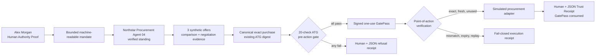

# Agent Trust Gate™ — Exact Action Trust Gateway

## Working local pilot prototype

Agent Trust Gate™ now provides a coherent local product experience that verifies the exact human authority behind the exact AI-agent action before a simulated procurement purchase is allowed to happen.

> **Status:** WORKING LOCAL PILOT PROTOTYPE
>
> **Data:** synthetic only
>
> **Execution:** simulated procurement execution only
> **External effects:** no real identity provider, procurement API, order, payment, bank API or settlement

Run the browser prototype:

```text
npm run prototype:exact-action
```

Run all seven deterministic buyer scenarios without starting a server:

```text
npm run prototype:exact-action:smoke
```

The browser defaults to `http://127.0.0.1:8794`. Use `npm run prototype:exact-action -- --port 0` to request an operating-system-selected local port.

## Product rule

> No verified authority. No valid mandate. No exact-action proof. No GatePass. No action.

Technical trust is presented as both machine-verifiable evidence and a human-readable Exact Action Trust Receipt.

## Repository audit and reuse decision

The mission began with a full repository inventory and contract review. The product flow reuses the strongest compatible implementations rather than creating another digest, signing or replay engine.

| Concern | Audited implementation | V1 decision |
|---|---|---|
| Verified Human Authority / Human Authority Proof | `src/human-authority-demo.mjs` and `scripts/human-authority-demo.mjs` | Extended the existing signed proof issuer with Northstar fixtures and an authority-only path. The prototype consumes its verified Human Authority Proof; it does not consume the older demo GatePass. |
| Agent standing | `src/agent-standing.ts` | Reused directly. Added a bounded Northstar fixture builder; evaluation still runs through `evaluateAgentStanding`. |
| Mandate validation | `src/gatepass-core.ts`, `src/local-gate-pass-receipt.ts`, `src/end-to-end-gatepass-pilot.ts` | Their fail-closed rules informed the 20-check policy. The product layer creates one explicit machine-readable procurement mandate and validates it before issuance. |
| Verified intent | `src/gatepass-core.ts`, `src/local-gate-pass-demo.ts`, `src/local-gate-pass-receipt.ts` | Expressed in V1 by the human instruction, bounded mandate and exact action; the human proof and mandate digests bind this intent into the exact-action envelope. |
| Evidence validation | `src/local-gate-pass-receipt.ts`, `src/end-to-end-gatepass-pilot.ts` | Reused policy semantics. Product evidence is deterministic, referenced, hashed and freshness checked. |
| Exact-action canonicalisation and digest | `src/exact-action-gatepass.ts` | Reused directly through `createCanonicalActionEnvelope` and `recomputeCanonicalActionDigest`. No competing purchase-action digest format was added. |
| Action binding | `src/exact-action-gatepass.ts` | Reused directly at point of execution through `verifyAndExecuteSimulatedAction`. |
| GatePass generation and signing | `src/exact-action-gatepass.ts`, `src/local-signed-proof.ts` | Reused `issueExactActionGatePass` and the existing Ed25519 local fixture key. |
| GatePass verification | `src/exact-action-gatepass.ts` | Reused directly through the point-of-action verifier. |
| Freshness, expiry, nonce and replay | `src/exact-action-gatepass.ts`, `src/local-gate-pass-protection.ts` | The purchase flow uses `InMemoryNonceStore`, verifier-owned time, expiry and one-use consumption from the exact-action engine. The earlier protection store remains intact for its receipt family. |
| Refusal receipts | `src/local-gate-pass-receipt.ts`, `src/end-to-end-gatepass-pilot.ts` | Reused as receipt-design precedent. The product layer emits a unified P3-M154 machine and human refusal receipt tied to the exact-action envelope. |
| Execution receipts | `src/exact-action-gatepass.ts`, `src/local-gate-pass-receipt.ts` | Reused the exact-action `ExecutionReceipt` inside the buyer-facing receipt, with a synthetic procurement adapter acknowledgement. |
| Settlement blocker | `src/local-settlement-blocker.ts` | Audited and retained. V1 uses the newer exact-action point-of-execution verifier as the procurement boundary; no settlement or payment is attempted. |
| End-to-end GatePass pilot | `src/end-to-end-gatepass-pilot.ts` | Reused its end-to-end lifecycle and evidence lessons; product orchestration consolidates them into the Northstar buyer journey. |
| Embedded commerce GatePass | `src/embedded-commerce-gatepass.ts` | Audited for basket/merchant/refusal semantics; retained unchanged because P3-M154 is a procurement exact-action flow. |
| Money-gate proof | `src/local-end-to-end-money-gate-proof.ts` | Audited as a no-real-settlement proof pattern; retained unchanged. |
| Receipt verification | `src/local-trust-receipt-verifier.ts`, `src/local-signed-proof.ts` | Reused canonical fixture signing primitives. `verifyExactActionTrustReceipt` verifies the product receipt, exact-action digest, GatePass/decision consistency, execution evidence, human-readable match and safety boundary. |
| Gateway server | `src/gateway-server.ts` | Reused the local Node HTTP architecture and fail-closed JSON route pattern in a focused product server. |
| Authentication | `src/gateway-auth.ts` | Reused directly; API-key mode is optional and off for the default buyer demo. |
| Rate limits | `src/gateway-rate-limits.ts` | Reused directly with a process-local request limit. |
| Audit logging | `src/gateway-logging.ts` | Reused directly for JSONL local request logs. |
| Reviewer kit | `src/gatepass-reviewer-kit.ts`, `REVIEWER_START_HERE.md` | Audited for reviewer clarity and claims boundaries. The buyer UI preserves explicit local/synthetic disclaimers on every screen. |

## Architecture



Only the synthetic adapter sits after point-of-action verification. It makes no network call and cannot create a real order or payment.

## Six buyer-visible stages

1. **Human Authority** — Alex Morgan's active appointment, role, authentication fixture, supplier-purchase scope, £25,000 limit, jurisdiction, risk tier and proof expiry.
2. **Mandate** — machine-readable human-to-agent delegation with objective, allowed actions, supplier/category, quantity, currency, amount, jurisdiction, risk, validity and evidence requirements.
3. **Agent Activity** — three fixed synthetic offers, a deterministic comparison and a £250 negotiated reduction to £23,750 with improved Net 45 terms.
4. **Proposed Action** — a canonical envelope binding organisation, proof, mandate, agent, supplier, product, quantity, amount, currency, terms, jurisdiction, risk, timestamp, nonce and policy version.
5. **ATG Decision** — 20 visible pass/block checks. GatePass issuance occurs only when every check passes.
6. **Execution & Audit** — point-of-action signature, digest, expiry and nonce verification; a successful GatePass is consumed before the synthetic adapter acknowledges the purchase.

## Scenarios

- **A — Allowed:** £23,750; GatePass issued; simulated purchase completes.
- **B — Overspend:** £31,000; authority and amount checks fail; no GatePass or purchase.
- **C — Wrong Human Authority:** active analyst has no purchase authority; refused.
- **D — Expired Authority:** signed Human Authority Proof is expired; refused.
- **E — Action Tampering:** GatePass binds £23,750; £24,250 execution attempt is blocked.
- **F — Replay:** first execution succeeds; second presentation is blocked as consumed.
- **G — Agent Standing Failure:** revoked delegation fails standing; refused.

An additional non-buyer control scenario covers an expired mandate.

## Files

- `src/exact-action-trust-gateway-prototype.ts` — orchestration, scenarios, checks, receipts and synthetic execution boundary.
- `src/exact-action-trust-gateway-prototype-server.ts` — loopback HTTP server and local integration routes.
- `src/exact-action-trust-gateway-prototype-cli.ts` — one-command server and smoke entrypoint.
- `prototype/exact-action/` — framework-free buyer interface.
- `test/exact-action-trust-gateway-prototype.test.ts` — core behavior and security-boundary tests.
- `test/exact-action-trust-gateway-prototype-server.test.ts` — local browser/API integration tests.

## Limitations

This is not production software, a security certification, regulatory certification, legal-compliance determination or real payment control. Fixture keys are public deterministic local material. Replay state and server sessions are process-local and non-persistent. Human and agent identity sources are synthetic registries. Production integration requires real identity, key custody, policy governance, durable atomic nonce storage, tenant isolation, monitoring and a customer-controlled downstream adapter.
