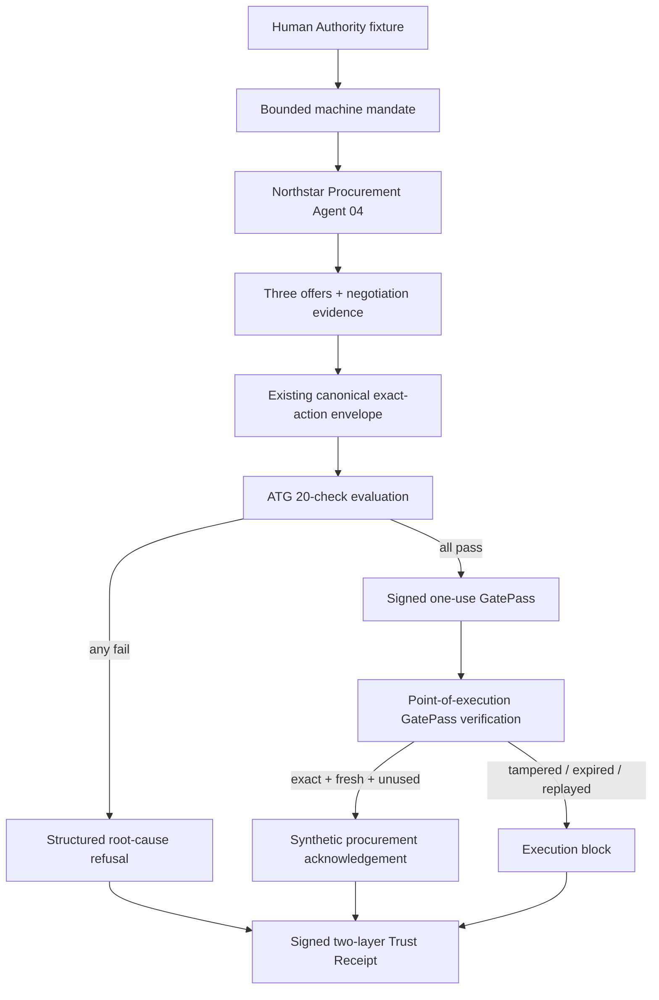

# P3-M155 Prototype Adversarial Hardening + Buyer Pilot Report

## Verdict

**Agent Trust Gate™ — Exact Action Trust Gateway is a working local pilot-ready prototype.** It demonstrates bounded human delegation, verified synthetic human authority, agent standing, exact-action pre-execution enforcement, signed one-use GatePass issuance/refusal, replay and tamper blocking, simulated execution, structured root-cause refusal and two-layer audit evidence.

It is not production software, a live payment or procurement system, a security certification, regulatory approval or a guarantee of compliance.

## M154 baseline retained

P3-M154 supplied the coherent local control flow, browser server/UI, synthetic Northstar procurement scenario, 20 pre-action checks, existing exact-action GatePass integration, simulated execution adapter, receipt verification, seven buyer scenarios, smoke command and 32 focused tests. The M155 work extends that implementation; it does not create a competing digest, GatePass or receipt engine.

### M154 change inventory preserved

- Source/orchestration: `src/exact-action-trust-gateway-prototype.ts`, `src/exact-action-trust-gateway-prototype-server.ts`, `src/exact-action-trust-gateway-prototype-cli.ts`.
- Reused primitive exports/fixtures: targeted updates to `src/agent-standing.ts`, `src/human-authority-demo.mjs` and `src/index.ts`.
- Buyer UI: `prototype/exact-action/index.html`, `app.js` and `styles.css`.
- Tests: `test/exact-action-trust-gateway-prototype.test.ts` and `test/exact-action-trust-gateway-prototype-server.test.ts`.
- Documentation: the four `docs/P3-M154-*` prototype, walkthrough, integration and report files.
- Commands: targeted `package.json` additions for browser launch, smoke and focused tests.
- The unrelated untracked `docs/ATG-ANEOS-R001-strategic-kill-and-reinvention.md` predates this work and is not part of M154 or M155.

## Existing components reused

- `src/human-authority-demo.mjs`: active organisation identity, authentication and bounded Human Authority Proof fixture.
- `src/agent-standing.ts`: agent identity, accountable principal, signed delegation, scope, revocation and standing decision.
- `src/exact-action-gatepass.ts`: canonical action envelope/digest, signing, verification, trusted-clock expiry, nonce registration/consumption and simulated execution receipts.
- `src/local-signed-proof.ts`: deterministic local fixture signing and receipt verification.
- Existing gateway authentication, logging and rate-limit modules in the local prototype server.
- The M154 orchestration in `src/exact-action-trust-gateway-prototype.ts`, browser assets and focused tests.

## Buyer manual-review finding

The £31,000 overspend path previously surfaced every affected check at the same visual level. Those details were technically accurate, but they did not distinguish the originating authority breach from controls that necessarily fail afterwards. A buyer could see several red checks without immediately knowing which fact caused refusal.

## Root-cause refusal improvement

The existing Trust Receipt now contains a `refusal` block rather than a parallel receipt family. It records:

- `primaryFailure`, `primaryFailureCode` and `primaryFailureSummary`;
- exact requested and authorised/permitted values;
- all `failedChecks` as audit detail;
- `consequentialBlocks`;
- `decision`, `gatePassIssued` and `executionPermitted`.

For overspend the primary code is `AUTHORITY_LIMIT_EXCEEDED`, with £31,000 requested and £25,000 authorised. The subsequent policy refusal, non-issuance and execution block are explicitly consequences. The top explanation does not claim the agent was revoked; detailed standing evidence may separately show that the £31,000 request exceeded its delegated amount scope.

Evaluation and execution failures use stable codes including human/authority, agent, mandate, supplier/product/currency/jurisdiction/risk, evidence, canonical action, GatePass expiry/signature, nonce, tamper and replay failures. Unknown states use a bounded fail-closed outcome.

## UI changes

- Refusal panel leads with **ACTION REFUSED** and **WHY ATG BLOCKED THIS ACTION**.
- Requested and authorised/permitted values sit beside GatePass `NOT ISSUED` and execution `BLOCKED`.
- Additional affected checks are collapsible below the primary reason.
- Success panel leads with verified human authority, agent standing, exact action, execution and GatePass state.
- The persistent 20-check view remains available for technical review.
- Receipt controls support local-only copy and JSON/text download.

## Trust Receipt changes

The signed machine receipt now includes an `executiveSummary` and structured `refusal`. The human-readable receipt has two labelled layers:

1. **EXECUTIVE SUMMARY** — who, organisation, agent, exact action, amount, reason, decision, GatePass, execution, timestamp and verification status.
2. **FULL AUDIT DETAIL** — authority proof, standing, mandate, procurement evidence, exact digest, policy, all checks, execution and safety flags.

Receipt verification checks the executive layer against signed machine evidence. Malformed receipts and malformed integrity blocks return `MALFORMED_TRUST_RECEIPT`; modified content fails the local fixture signature/digest verification.

## Architecture

## Data and GatePass flow

The agent presents the complete action and evidence references. The M154 orchestration calls the human and standing evaluators, constructs the mandate/evidence fixtures and passes the action to the existing canonical envelope. All checks must pass before the existing GatePass issuer signs the digest. The server stores the evaluation in a local process session; its only execution route calls `executeWithGatePass`. The verifier reconstructs the presented action, verifies signing/time/bindings and consumes nonce state only for an acknowledged exact match.

## Simulated execution boundary

The adapter callback creates only a `synthetic-procurement://` reference. The execution and Trust Receipts state that no network call, external API, real order, payment or settlement occurred. Missing, malformed, expired, mismatched, invalid-signature or replayed GatePasses cannot reach a successful acknowledgement.

## Buyer walkthrough result

The built server was launched with the documented command and served the loopback browser page. A complete HTTP/UI-boundary walkthrough observed Alex Morgan, the generated mandate, three inspected offers, the £23,750 proposal, 20/20 passing checks, `GATEPASS_ISSUED`, `SIMULATED_PURCHASE_COMPLETED`, a consumed GatePass and a locally verified executive/full Trust Receipt. Re-presentation returned `BLOCKED_REPLAY`. Switching to £31,000 returned `ACTION_REFUSED` with `AUTHORITY_LIMIT_EXCEEDED`, £31,000 requested, £25,000 authorised, `gatePassIssued: false`, `executionPermitted: false` and `BLOCKED_NO_GATEPASS`. The execution receipt confirmed `networkCallPerformed: false` and `realOrderCreated: false`.

## Adversarial matrix

All 32 required cases are implemented in `test/exact-action-trust-gateway-adversarial.test.ts`:

1. valid purchase;
2. overspend;
3. unauthorised human;
4. expired human authority;
5. revoked agent;
6. expired mandate;
7. wrong supplier;
8. wrong product/category;
9. wrong currency;
10. wrong jurisdiction;
11. wrong risk tier;
12. missing evidence;
13. stale evidence;
14. missing mandate;
15. missing Human Authority Proof;
16. malformed exact action;
17–21. amount, supplier, quantity, currency and policy changed after GatePass;
22. expired GatePass;
23. replayed GatePass;
24. missing GatePass;
25. malformed GatePass;
26. invalid signature;
27. nonce mismatch;
28. unknown agent;
29. unknown human;
30. malformed receipt;
31. receipt tampering;
32. execution attempted after refusal.

Every unsafe case fails closed and records no real order or payment.

## Security findings

- The existing canonical digest changes when any of 17 execution-critical fields changes.
- GatePass action digest and policy decision binding are verified at execution.
- Verifier-owned time enforces expiry.
- Nonces are registered unused, atomically consumed within the local process and rejected on replay.
- Signature verification is mandatory; malformed and invalid signatures block.
- Missing, stale, malformed and unknown evidence states refuse.
- The local server has no direct downstream-adapter route; a valid evaluated run still passes through GatePass verification.

These are local test findings, not an external security assessment or certification. Process-local nonce storage and deterministic fixture keys are deliberate prototype limits.

## Buyer assets

- [Buyer pilot pack](P3-M155-buyer-pilot-pack.md)
- [5–8 minute demo script](P3-M155-buyer-demo-script.md)
- [Controlled pilot integration guide](P3-M155-controlled-pilot-integration-guide.md)
- [Public screenshot plan](P3-M155-public-screenshot-plan.md)
- Updated repository [README](../README.md) and [reviewer start](../REVIEWER_START_HERE.md)

## Test evidence

Final release-gate results are recorded after the complete run:

- Typecheck: **PASS**
- Build: **PASS**
- Full `npm test`: **PASS — 1,382 passed, 0 failed** (675 + 707 configured test invocations)
- Human Authority: **PASS — 9 passed**
- Agent Standing: **PASS — 13 passed**
- M154 focused prototype: **PASS — 32 passed**
- M155 adversarial matrix: **PASS — 32 passed**
- Prototype smoke: **PASS — 7/7 buyer scenarios**
- `git diff --check`: **PASS**

## Limitations and safety boundaries

- loopback/local process only;
- synthetic Northstar, Alex, agent, suppliers, offers and actions only;
- no real identity provider, WebAuthn credential or authoritative employee directory;
- deterministic local fixture keys, not production key custody;
- in-memory replay state, not distributed persistence;
- no external procurement, ERP, contract, bank, payment or settlement API;
- no real order, payment, settlement or autonomous capital execution;
- no production availability, tenant isolation or operations claim;
- no legal, regulatory, security or compliance certification.

## Future controlled integration points

A separately authorised pilot could map buyer sandbox identities and policies, accept only synthetic or sanitised scenario data, replace the downstream fixture with a buyer-controlled sandbox adapter, use pilot-appropriate signing/replay infrastructure and export structured receipts to buyer-controlled audit tooling. None of those integrations exists in V1.

## Commercial readiness score

| Criterion | Score |
|---|---:|
| Core exact-action enforcement | 15/15 |
| Human authority proof | 10/10 |
| Agent standing | 8/8 |
| GatePass integrity | 10/10 |
| Replay/tamper protection | 10/10 |
| Failure clarity | 10/10 |
| Trust Receipt usability | 9/10 |
| Buyer demo clarity | 8/8 |
| Controlled pilot integration | 7/7 |
| Adversarial coverage | 7/7 |
| No-regression quality | 5/5 |
| **Total** | **99/100** |

Only implemented, tested behaviour is scored. The one-point reservation recognises that buyer receipt usability has not yet been validated in an external buyer session.

## Git release result

Before the mission commit, local `main` was four already-committed changes ahead of the then-observed `origin/main` (P3-M156A, P3-M156B, P3-M156C and P3-M157). P3-M157 is the repository baseline on which the supplied M154 count of 1,344 tests passes; it aligns the checked-in discovery site and validator tests. Those existing commits were not rewritten by M155.

The release commit uses subject `P3-M155 Launch Exact Action Trust Gateway pilot prototype`. Its exact SHA is reported in the mission completion output because a Git commit cannot contain its own final object ID.

- Initial push result: **REJECTED NON-FAST-FORWARD; NOT PUSHED**. `origin/main` advanced by 15 unrelated corporate-site commits during the mission.
- Safe integration check: a non-destructive trial merge preserved the newer corporate site and resolved three content conflicts, but four established discovery-site tests failed: local public-link validation, expected metadata/indexability, external script/analytics policy and the compiled discovery-site validator.
- Release decision: **DO NOT PUSH**. The merge was aborted rather than force-push, discard the remote site, weaken historical safety tests or expand P3-M155 into an unrelated corporate-site policy change.
- Current divergence: local `main` is 5 commits ahead of and 15 commits behind the fetched `origin/main`.
- Working tree exception: the pre-existing unrelated untracked `docs/ATG-ANEOS-R001-strategic-kill-and-reinvention.md` remains deliberately excluded and untouched.

## Final verdict

**CONDITIONAL — 99/100 implementation quality.** The prototype and its local release gates pass, but the public lock is withheld because the current remote history cannot be integrated without failing existing tests. No production deployment or certification is claimed.
