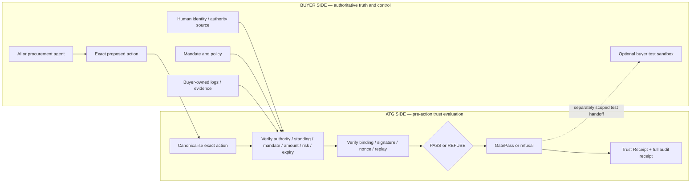

# P3-M156 Controlled External Buyer Pilot Readiness Report

## Decision

**Verdict: READY FOR CONTROLLED BUYER PILOT — 93/100.**

This verdict means the existing Agent Trust Gate™ Exact Action Trust Gateway can be presented to a suitable organisation for a bounded, local, synthetic, decision-and-evidence pilot. It does not mean production ready, certified, regulator approved, commercially validated, guaranteed secure or guaranteed to prevent fraud or loss.

No external buyer, system, credential, customer record, payment, procurement action or production endpoint was used in this mission.

## What this package establishes

The buyer can now answer the core commercial questions without reading source code:

| Question | Controlled-pilot answer |
|---|---|
| What does the buyer give ATG? | A complete synthetic exact action plus buyer-owned authority, mandate, agent-standing, policy, time, nonce and evidence inputs mapped to the pilot contract |
| What does ATG verify? | The 20 implemented checks covering human evidence/authority, agent standing, mandate/scope, amount and context, evidence, policy, canonical binding, freshness and replay state |
| What does ATG refuse? | Every missing, malformed, stale, unknown, out-of-scope, unauthorised or policy-blocked request; invalid execution authority is blocked |
| What does ATG return? | PASS/REFUSE, reason evidence, action digest, a signed local-fixture GatePass only on allow, and executive/machine receipts |
| What evidence is created? | Human Authority Proof and Agent Standing references, mandate/evidence chain, checks, policy decision, GatePass/refusal, exact digest, timestamps and signed local Trust Receipt |
| What does ATG not control? | Buyer identity truth, buyer policy truth, legal approval, production systems and all real execution |
| What remains buyer-controlled? | Authorisation sources, agents, policy, test data, environment, downstream executor, legal/compliance decisions, retention and any production decision |
| How does the pilot avoid real exposure? | Evaluation-only by default, synthetic/minimised data, no production secrets or endpoints, loopback execution demonstration only |
| What does success look like? | Correct repeatable decisions, fail-closed adversarial results, intelligible receipts, reconstructable evidence and understood integration burden |
| What precedes production? | Separate identity/adaptor engineering, hardened keys/replay state, security/privacy/operational design, buyer governance and independent review; none is included here |

## 1. Exact pilot boundary

### Architecture and ownership



### Execution choice

**Default: A — ATG returns the decision and evidence; the buyer owns and operates every execution system separately.** No buyer executor is connected in the controlled local pilot and a PASS is not an execution command.

The repository strongly supports a safe demonstration of choice B only through its existing loopback, synthetic adapter. That adapter verifies the exact GatePass immediately before recording a `synthetic-procurement://` acknowledgement. It makes no network call, order, payment or settlement. It may be shown to prove handoff semantics, but it is not the default external-pilot architecture and must not be represented as buyer integration.

This prevents ATG from becoming an autonomous execution engine. A future buyer-controlled sandbox adapter would be a separately approved scope.

## 2. Implemented state versus requirements

| Capability | Currently implemented | Controlled-pilot integration requirement | Future production requirement |
|---|---|---|---|
| Human authority | Signed deterministic Northstar fixture, active/role/scope/amount/jurisdiction/risk/expiry checks | Map buyer-approved synthetic authority examples; buyer attests source truth | Authoritative directory/IdP integration, lifecycle controls and lawful governance |
| Agent standing | Signed local registration/delegation, capability, revocation and binding checks | Map test agent status and accountable owner | Production agent registry, key lifecycle and revocation distribution |
| Mandate/policy | Machine-readable bounded mandate and fixed versioned policy fixture | Agree field meanings and expected boundary cases | Governed policy service, approval/change lifecycle and tenancy |
| Exact action | Existing canonical envelope and digest over 17 execution-critical fields | Agree buyer action schema and lossless mapping | Versioned schemas, migration/backward compatibility and integration assurance |
| Decision | Twenty fail-closed checks and structured root-cause refusal | Run agreed synthetic scenarios and review outcomes | Resilient service, monitoring, availability and incident operations |
| GatePass | Signed short-lived exact-action pass with local fixture key | Treat only as test evidence; optional local synthetic handoff | Hardened HSM/KMS custody, key rotation/trust distribution and adapter authentication |
| Replay protection | In-memory nonce registration and one-use consumption | Keep one process trust boundary and document resets | Durable atomic distributed store, recovery and multi-region consistency |
| Receipts | Signed local-fixture executive and full JSON receipt with verifier | Agree classification, export and buyer correlation mapping | Durable secure storage, access control, retention/legal hold and external system connectors |
| Execution | Local synthetic procurement callback only | None by default; optional local demo | Separately engineered buyer-controlled adapter and production approval |
| Deployment/data | Loopback local process and synthetic fixtures | Approved workstation/sandbox, minimised test data and cleanup | Tenant isolation, secrets, privacy, platform security and operational assurance |

Roadmap and integration requirements in the last two columns are not representations of current functionality.

## 3. Three bounded pilot scenarios

### Scenario 1 — valid authorised action

Alex Morgan, a synthetic Northstar Procurement Director, has supplier-purchase authority up to £25,000. Northstar Procurement Agent 04 has valid standing and a bounded mandate. It proposes 200 units of Product X from Harbour Supply Ltd for £23,750 GBP.

Expected and implemented result: `GATEPASS_ISSUED`; all 20 checks pass; exact digest, GatePass, Human Authority Proof, standing evidence, Trust Receipt and full audit receipt are generated. Under the default pilot no buyer execution is invoked. The optional local demonstration can consume the GatePass and record a synthetic acknowledgement.

### Scenario 2 — authority or mandate violation

The request is changed to £31,000 against the verified £25,000 maximum.

Expected and implemented result: `ACTION_REFUSED`; primary code `AUTHORITY_LIMIT_EXCEEDED`; £31,000 requested and £25,000 authorised are shown; policy non-permission, GatePass non-issuance and blocked execution are identified as consequences. No GatePass is emitted and refusal evidence is generated.

Wrong human, expired authority, expired mandate and other out-of-scope cases remain available as supplementary tests.

### Scenario 3 — adversarial or replay attempt

An allowed action is altered after GatePass issuance, or its GatePass is presented again after the local synthetic adapter consumed it.

Expected and implemented result: an altered digest returns `EXACT_ACTION_MISMATCH`; a repeated consumed nonce returns `GATEPASS_REPLAY`. No valid execution authority or second synthetic acknowledgement is produced. The block receipt retains expected/presented digest or replay evidence.

## 4. Minimal pilot integration contract

The current public conceptual operations are:

```ts
evaluateExactAction(input)       // decision, evidence and optional GatePass
executeWithGatePass(context)     // local synthetic demonstration only in V1
verifyTrustReceipt(receipt)      // local-fixture integrity verification
```

The current prototype accepts scenario-shaped synthetic input and resolves authority/standing fixtures internally. Accepting a buyer's arbitrary external evidence source requires a separately reviewed mapping adapter; that adapter does not exist today.

### Inputs

`Required` is for an evaluable action. Sensitive classification is contextual and requires buyer review even where the prototype fixture is synthetic.

| Input | Required | Source/owner | Potentially sensitive | Allowed in controlled pilot |
|---|---|---|---|---|
| Exact proposed action | Yes | Buyer | Yes—commercial context | Synthetic or approved minimised test payload only |
| Action ID | Yes | Buyer | Low/possible linkage | Synthetic unique identifier |
| Organisation ID | Yes | Buyer | Possible | Synthetic/pseudonymous identifier |
| Human identity and authority evidence | Yes | Buyer authoritative source | Yes—identity/role | Synthetic by default; non-synthetic only under separate documented approval |
| Human authentication evidence reference | Yes | Buyer | Yes | Synthetic assertion/reference; no live credential |
| Organisational mandate | Yes | Buyer | Yes—policy/limits | Synthetic or sanitised bounded mandate |
| Agent identity and standing | Yes | Buyer authoritative source | Yes—system identity | Synthetic/pseudonymous record, status and capability |
| Policy and version references | Yes | Buyer | Possible confidential policy | Approved test identifier and mapped rules |
| Action timestamp and validity times | Yes | Buyer supplies; ATG validates | Low | Fixed or test clock values |
| Nonce/replay material | Yes | Buyer/ATG protocol boundary | Security relevant | One-use synthetic value; never a reused production secret |
| Amount, currency and risk metadata | Yes where applicable | Buyer | Commercially sensitive | Synthetic boundary values |
| Supplier/target, product/category, quantity, terms | Yes for this procurement shape | Buyer | Commercially sensitive | Synthetic identifiers/terms |
| Jurisdiction and department/account | Yes where policy requires | Buyer | Possible organisational sensitivity | Synthetic/scoped values |
| Research/negotiation evidence and freshness | Yes for configured scenario | Buyer or test agent | Commercially sensitive | Synthetic evidence records and timestamps |
| Buyer sandbox correlation/reference | No; only if separately scoped | Buyer | Yes | Non-production opaque reference; not an endpoint credential |

Missing required evidence fails closed. Optional means not required for the default contract; it never means ATG may infer an omitted required value.

The current synthetic scenario derives its action/run identifier internally rather than accepting a buyer action ID as a free-standing external parameter. Preserving the buyer's action ID losslessly is therefore a controlled-pilot mapping requirement, not a claim about the present fixture API.

### Outputs

| Output | Produced when | Source/owner | Potentially sensitive | Allowed in controlled pilot |
|---|---|---|---|---|
| PASS (`GATEPASS_ISSUED`) or REFUSE (`ACTION_REFUSED`) | Every evaluation | ATG-generated; buyer retains copy | Decision metadata | Yes |
| Primary and detailed reason codes | Refusal/block; checks always available | ATG-generated | May reveal policy boundary | Yes, buyer-controlled review |
| Canonical action digest | Every structurally evaluated action | ATG-generated | Correlation metadata | Yes |
| Signed local-fixture GatePass | Allow only | ATG-generated | Security relevant test artifact | Yes; test evidence only, short-lived and one-use |
| Human Authority Proof reference/evidence | Evaluation | Buyer truth represented by ATG fixture/proof | Yes | Synthetic/minimised only |
| Agent Standing evidence | Evaluation | Buyer truth represented by ATG standing receipt | Yes | Synthetic/minimised only |
| Executive Trust Receipt | Every decision and execution/block update | ATG-generated | Summarises action/authority | Yes |
| Full machine-readable audit receipt | Every decision and execution/block update | ATG-generated | Detailed evidence/policy | Yes under agreed access/retention |
| Timestamps and version identifiers | Every receipt | ATG-generated and input-derived | Low/correlation | Yes |
| Local synthetic execution acknowledgement | Only optional local demo | ATG local adapter | Test-only | Yes; never a real system record |
| Buyer downstream log/acknowledgement | Not generated by current prototype | Buyer-owned | Buyer classified | Outside default; future sandbox mapping only |

These outputs are designed to make future SIEM/GRC/audit mapping assessable; no such integration is implemented or claimed.

## 5. Pilot security and data model

### Required controls

- synthetic/test data by default and field minimisation;
- no production secret, payment credential, bank detail, reusable shared password, customer secret or unapproved PII;
- no production or external API and no autonomous execution;
- buyer retains authoritative identity, permissions, standing and policy directories;
- buyer retains every final execution system and decision right;
- missing, malformed, stale or unknown evidence fails closed;
- explicit authority, mandate, evidence and GatePass validity;
- exact-action digest/signature validation and nonce/replay enforcement;
- buyer-source logs remain buyer-owned; ATG receipts remain locally controlled pilot evidence;
- a written data location, access, retention and deletion agreement before buyer material is introduced; and
- production-grade secrets management is a future requirement, not a property of deterministic fixture keys.

### Data lifecycle assumption

The repository does not provide a managed retention service. Before testing, the parties identify every input, console output, downloaded receipt and test report location; name its owner; set access; agree the shortest useful retention; and define deletion confirmation. A pilot run stops if these facts are unknown. Receipt retention must not be expanded merely because the receipt is useful.

## 6. Success and abort criteria

The measurable functional, evidence, operational and commercial criteria are specified in the [pilot test plan](P3-M156-pilot-test-plan.md). Latency is measured on the chosen pilot hardware with method, configuration and sample size. No target is fabricated before a baseline and buyer need exist.

Explicit aborts include inconsistent decisions, authority/standing/mandate bypass, binding/signature/expiry/replay failure, unexplained evidence mismatch, unintelligible refusal, live credential or data exposure, real effect, execution after refusal, unapproved scope growth, or certification overclaim. The pilot fails safely and does not continue on a best-effort allow.

## 7. Responsibility and risk

The [responsibility matrix](P3-M156-pilot-responsibility-matrix.md) makes the buyer authoritative for identity, authority, standing truth, policy, data, environment, execution, legal/compliance approval and production decisions. ATG owns implemented exact-action evaluation, fail-closed decision, GatePass/refusal and receipts. Mapping, tests, findings and change control are shared.

The [risk register](P3-M156-pilot-risk-register.md) covers demonstrator over-reliance, source staleness, mapping/policy errors, canonicalisation, replay/tamper, data exposure, receipt interpretation, downstream bypass, scope creep, maturity expectations, correlation, process-reset limits, retention and cherry-picking. Each risk has a qualitative probability/impact, mitigation, owner and stop condition.

## 8. Executive Trust Receipt review

The receipt was audited against the questions a CIO, CISO, Head of AI, procurement leader, financial controller and risk/compliance reviewer are likely to ask.

| Reviewer need | Evidence visible without source code | Assessment |
|---|---|---|
| What action and amount? | Executive exact-action sentence, formatted amount/currency; full supplier/product/quantity/digest | Clear |
| Which agent? | Named agent in executive layer; ID, standing and capability in full detail | Clear |
| Which human and organisation? | Named authoriser and organisation; role/proof in detail | Clear |
| Authorised for this exact action and limits? | Decision reason plus detailed Human Authority Proof, mandate, £25,000 limit and 20 checks | Clear; buyer remains source of truth |
| What decision and why? | Decision and plain-English reason in executive layer; root cause and exact requested/permitted values on refusal | Clear |
| Was action altered or replayed? | Execution-block decision, GatePass status, reason code and expected/presented digest or replay evidence | Clear |
| What evidence exists? | Proof, standing, mandate, procurement evidence, policy, checks, GatePass/refusal, receipt integrity | Complete for prototype scope |
| Can it be audited later? | Signed JSON plus human text and stable correlation identifiers | Yes within local-fixture/retention limits |

Persona findings:

- **CIO:** architecture boundary and implementation burden are visible; production integration remains explicitly separate.
- **CISO:** fail-closed result, binding, signatures, nonce/replay and local key/store limitations are visible.
- **Head of AI:** accountable human, agent standing and bounded delegation are traceable.
- **Procurement leader:** supplier, product, quantity, amount, terms and negotiation evidence are readable.
- **Financial controller:** requested versus authorised amount and execution/GatePass state are prominent.
- **Risk/compliance reviewer:** policy version, checks, evidence and receipt verification support review without claiming compliance.

No receipt wording change was justified: the M155 executive summary and full-detail split already answers every review question, and changing the security-critical receipt would add regression risk without a demonstrated usability defect. Actual external user research remains outstanding.

## 9. Pilot-model adversarial review

| Attack or misuse | Implemented/pilot control | Residual risk and required ownership |
|---|---|---|
| Bypass ATG | Default pilot has no executor; local server exposes no direct synthetic-adapter route | Buyer could build an out-of-band executor; buyer architecture/governance must prevent it |
| Reuse GatePass | One-use nonce consumption and replay refusal in process | Current state is not durable across restart; future pilot adapter needs atomic persistent state |
| Change action after approval | Canonical digest and execution-time exact binding | Mapping layer could omit a critical field; shared schema review required |
| Misrepresent or use stale authority | Signed fixture, status/scope/expiry checks | Buyer source truth may be wrong/stale; buyer owns directory integrity |
| Substitute agent | Agent/action/session/tool bindings and standing validation | External identity binding requires separately engineered adapter/trust roots |
| Exceed amount or scope | Authority, mandate, standing and policy checks; root-cause refusal | Misconfigured policy remains possible; buyer owns truth and boundary cases |
| Misunderstand receipt | Executive/full layers, status/disclaimer, local verification | Human over-reliance remains; walkthrough and claims acknowledgement required |
| Execute after refusal | No GatePass; local adapter blocks missing pass | Buyer-controlled system could ignore ATG; buyer owns enforcement placement |
| Treat evidence as certification | Explicit prototype/local-fixture and claims boundaries | Commercial/user language can drift; shared review and stop condition |
| Introduce live credentials | Synthetic-default intake, prohibited-input list and review | Human error remains; buyer data owner and pre-run inspection required |

No new trust-engine gap was found. Existing M155 adversarial coverage already exercises the implementation attacks. P3-M156 adds contract tests for the three pilot outcomes, executive evidence, no-network boundary and the completeness/honesty of the new pilot package.

## 10. Verification evidence

The final integrated results for the P3-M156 change set are:

- Typecheck: **PASS**
- Production build: **PASS**
- Full automated suite: **PASS — 1,394 passed / 0 failed** (675 + 719 configured test invocations)
- Focused discovery/corporate-site tests: **PASS — 55 passed / 0 failed**
- Discovery validator: **PASS — 23/23 checks**
- Human Authority tests: **PASS — 9 passed / 0 failed**
- Agent Standing tests: **PASS — 13 passed / 0 failed**
- P3-M155 adversarial suite: **PASS — 32 passed / 0 failed**
- Prototype smoke: **PASS — 7/7 scenarios; `networkCallPerformed: false`**
- New P3-M156 pilot-readiness tests: **PASS — 12 passed / 0 failed**
- `git diff --check`: **PASS before final commit gate**

No test was weakened, skipped or removed. The full count increased by the 12 additive P3-M156 contract and scenario tests.

## 11. Independent pilot-readiness score

| Criterion | Weight | Score | Evidence / reservation |
|---|---:|---:|---|
| Core trust-control maturity | 15 | 14 | Complete local flow; external source adapters are not implemented |
| Security/adversarial resilience | 15 | 14 | Strong local suite; deterministic keys and process-local replay store are prototype limits |
| Pilot integration clarity | 10 | 10 | Field-level contract, ownership and default no-execution boundary |
| Buyer comprehension | 10 | 9 | Executive package/receipt clear; not yet validated with an external buyer |
| Evidence/audit quality | 10 | 10 | Signed local machine receipt plus correlated human summary/detail |
| Pilot safety | 10 | 10 | Synthetic default, no live systems, explicit aborts and claims boundary |
| Operational repeatability | 10 | 9 | Deterministic tests; no buyer-environment observation yet |
| Implementation burden clarity | 5 | 4 | Mapping steps clear; buyer-specific effort remains unmeasured |
| Commercial demonstrability | 10 | 8 | Strong scenarios; no external workflow validation or buyer evidence yet |
| Production-boundary honesty | 5 | 5 | Current, pilot-required and future capabilities explicitly separated |
| **Total** | **100** | **93** | **Ready only for the bounded evaluation described here** |

The mission requires an independent assessment rather than preservation of the earlier prototype score. The deductions reflect the absence of an external authority adapter, persistent replay store, buyer-observed usability/performance and commercial workflow validation. Those are appropriate limitations for an evaluation-only pilot, not hidden features.

**Final independent verdict: READY FOR CONTROLLED BUYER PILOT — 93/100**, strictly subject to the intake entry gates and no-production boundary. There is no mandated numeric threshold for this mission; readiness means only that a suitable buyer may be invited into this bounded evaluation process.

## 12. Remaining risks and exact next action

The package is safe for a controlled local pilot invitation only after a prospective workflow passes the intake checklist. The first activity is a no-data scoping workshop: identify one workflow, owner, exact action schema, authority/standing sources, current control gap and synthetic test cases. Do not request data, credentials or system access at that stage. If intake passes, agree a written evaluation-only pilot charter and field map before receiving any synthetic payload.

Production engineering, buyer-sandbox integration, external outreach and P3-M156 follow-on execution are outside this mission.
